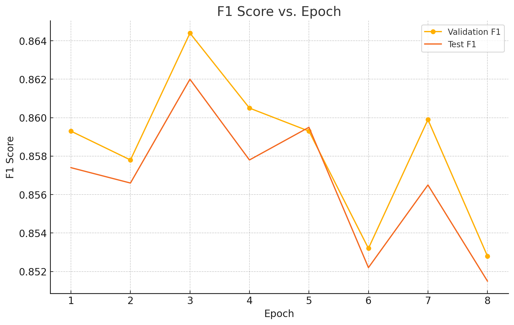

# Introduction
The original idea on this project was using Sentence Transformers(SBERT, for reference view https://sbert.net/) embedding to classify, human and AI generated text. However this attempt was unsuccessful because features that were extracted from SBERT failed to capture any significant information as shown in t-SNE plot below. Seeing this, choose to fine tune pretrained LLM RoBERTa. 


## Theoretical Background

In this study, several foundational concepts in natural language processing and deep learning are used to distinguish between AI- and human-written texts. **RoBERTa**, an improved version of BERT, is employed for its optimized pretraining strategies and enhanced language understanding. The model architecture is based on the **Transformer**, which relies solely on **attention mechanisms** to process sequential data efficiently. The attention mechanism helps the model focus on relevant parts of the input, allowing better context understanding.

At a lower level, the **perceptron** serves as the basic unit of deep neural networks, supporting more complex architectures like multi-layer networks. **Large Language Models (LLMs)**, such as ChatGPT, generate coherent text by predicting word sequences based on prior data. These models are trained using **backpropagation**, a method that calculates gradients using the **chain rule** to adjust model parameters.

**Fine-tuning** is applied to adapt a pre-trained model to a specific dataset, improving task-specific performance. In this project, RoBERTa is fine-tuned to classify U.S. Senate press releases as either human- or AI-generated, utilizing these core principles in a practical application.


#Methods

Our approach combines sentence-level encoding with a multi-attention mechanism to classify paragraph-level text.
## RoBERTector

RoBERTector is finetuned RoBerta that specify on AI detection on sentence level. it's predeictive abilitwes were Accuracy: 0.8648  F1 Score: 0.8644 on validation set. 

## Architecture

### 1. Sentence Splitting  
- **Objective**: Break each variable‑length paragraph into a fixed number of sentence slots.  
- **Process**:  
  1. **Token‑level segmentation**: Split on sentence delimiters (e.g., “.”, “?”, “!”), trim whitespace, filter out empty results.  
  2. **Truncation**: If a paragraph yields more than 16 sentences, keep only the **first 16** (to cap memory/compute).  
  3. **Padding**: If fewer than 16, pad with dummy “<PAD>” sentences so that every input tensor has shape `(batch_size, 16, max_len)`.  
- **Benefit**: Guarantees a consistent input tensor shape for downstream encoders and attention, simplifying batching and avoiding dynamic control flow.

---

### 2. Sentence Encoding with RoBERTector  
- **Encoder**: A frozen, fine‑tuned **RoBERTector** (RoBERTa model trained on AI vs. human sentence labels).  
- **Independent Processing**:  
  1. Each of the 16 sentence slots is tokenized (up to `max_length` tokens) and fed independently through the transformer encoder.  
  2. We extract the **CLS** token embedding (size 768) from each run, yielding a matrix of shape `(batch_size, 16, 768)`.  
- **Why Freeze?**:  
  - Locks in sentence‑level distinctions learned during sentence‑level fine‑tuning.  
  - Reduces risk of overfitting on the smaller paragraph dataset and cuts training time.

---

### 3. Multi‑Attention Layer  
- **Purpose**: Learn to weigh each sentence’s contribution to the paragraph classification.  
- **Mechanism**:  
  1. **Self‑Attention**: Apply a `MultiheadAttention` module (4 heads, `embed_dim=768`) to the 16 CLS embeddings.  
     - Query, Key, Value all ← sentence embedding matrix  
     - Produces attended outputs and a `(batch_size, 16, 16)` attention weight tensor per head.  
  2. **Aggregation**:  
     - **Mean‑pool** the attended outputs across the sentence dimension → `(batch_size, 768)`.  
- **Advantages**:  
  - **Adaptive Focus**: Heads can specialize on stylistic cues, discourse markers, or cohesion patterns.  
  - **Inter‑Sentence Dynamics**: Captures transitions, contradictions, or repetitive structures indicative of AI text.

---

### 4. Final Decision  
- **Classification Head**: A lightweight MLP (`768 → 384 → 1`) with ReLU, dropout (0.1), and **no upstream fine‑tuning** beyond the head.  
- **Output**: Single logit per paragraph → passed through **sigmoid** → probability \(p\) that the paragraph is AI‑generated.  
- **Thresholding**:  
  - Decision rule:  
    \[
      \hat{y} = 
      \begin{cases}
        1 & \text{if } p \ge 0.5 \\
        0 & \text{otherwise}
      \end{cases}
    \]
- **Training Details**:  
  - **Loss**: `BCEWithLogitsLoss` on the raw logit (stable combination of sigmoid + binary CE).  
  - **Optimizer**: AdamW (lr=1e‑4) on attention + MLP parameters only.  
  - **Checkpointing**: Save model weights after **every epoch**.  
  - **Validation/Test**: 80/10/10 split on ~20K paragraphs; test evaluated **once** at the end.


## Fine tuning RoBERTa
Fine tuned Roberta will be adressed as RoBERTector

### Set up python enviroment
```{r setup, include=FALSE}
knitr::opts_chunk$set(echo = TRUE)
library(reticulate)

use_python(
  "C:/Users/ahnd6/AppData/Local/Programs/Python/Python39/python.exe", #use your own path to python
  required = TRUE
)
py_config()

```
### Install packages
```{r install-python-pkgs, include=FALSE}
library(reticulate)

# packages to install
pkgs <- c('transformers', 'datasets', 'torch',
          'scikit-learn', 'evaluate', 'pandas', 'tqdm')

# Detect packages that are not yet installed
to_install <- pkgs[!sapply(pkgs, py_module_available)]

if (length(to_install)) {
  # install as pip option
  py_install(packages = to_install, pip = TRUE)
}
```
### Load data and split paragraphs into sentences
```{python}
import pandas as pd
df=pd.read_csv('/kaggle/input/ai-text/ai_press_releases.csv')
df=df.dropna()
human=df['non_chat_gpt_press_release']
ai=df['chat_gpt_generated_release']
hu=[]
a=[]
for i in human:
    l=list(i.split('. '))
    hu.extend(l)
for i in ai:
    l=list(i.split('. '))
    a.extend(l)

ap=a.copy()
a.extend(hu)
texts=a
labels=[0 if i<len(ap) else 1 for i in range(len(texts))]
from sklearn.model_selection import train_test_split

#split train, test and validation data. 
texts_train_val, texts_test, labels_train_val, labels_test = train_test_split(
    texts,
    labels,
    test_size=0.2,       # 20% of the entire dataset
    random_state=42,
    stratify=labels      # Maintain label distribution
)

# 2) Split train_temp again into train (75% of temp → 60% of the total) and val (25% of temp → 20% of the total)
texts_train, texts_val, labels_train, labels_val = train_test_split(
    texts_train_val,
    labels_train_val,
    test_size=0.25,      #25% of train_temp → 0.2 of total
    random_state=42,
    stratify=labels_train_val
)

print(f"Train: {len(texts_train)} samples")
print(f"Valid: {len(texts_val)} samples")
print(f"Test : {len(texts_test)} samples")

```

# Load Roberta and fine tune
```{python}
import torch
from torch.utils.data import DataLoader
from transformers import AutoTokenizer, AutoModelForSequenceClassification
from torch.optim import AdamW
from datasets import Dataset
from tqdm.auto import tqdm
from sklearn.metrics import accuracy_score, f1_score

# Load pretrained tokenizer
tokenizer = AutoTokenizer.from_pretrained("roberta-base")

# Function to prepare batch inputs
def collate_fn(batch):
    enc = tokenizer(
        [x["text"] for x in batch],  # Extract texts
        padding="longest",           # Pad to the longest in batch
        truncation=True,             # Truncate if too long
        max_length=256,              # Limit to 256 tokens
        return_tensors="pt"          # Return PyTorch tensors
    )
    enc["labels"] = torch.tensor([x["label"] for x in batch], dtype=torch.long)
    return enc

# Convert to HuggingFace Dataset format
train_ds = Dataset.from_dict({"text": texts_train, "label": labels_train})
val_ds   = Dataset.from_dict({"text": texts_val,   "label": labels_val})
test_ds  = Dataset.from_dict({"text": texts_test,  "label": labels_test})

# Create PyTorch DataLoaders
train_loader = DataLoader(train_ds, batch_size=16, shuffle=True, collate_fn=collate_fn)
val_loader   = DataLoader(val_ds,   batch_size=32, shuffle=False, collate_fn=collate_fn)
test_loader  = DataLoader(test_ds,  batch_size=32, shuffle=False, collate_fn=collate_fn)

# Model and optimizer configuration
device = torch.device("cuda" if torch.cuda.is_available() else "cpu")  # Use GPU if available
model  = AutoModelForSequenceClassification.from_pretrained("roberta-base", num_labels=2).to(device)  # Binary classification
optim  = AdamW(model.parameters(), lr=2e-5)  # Use AdamW optimizer

num_epochs = 8  # Train for 8 epochs

# Training loop
for epoch in range(1, num_epochs+1):
    # 1) Training phase
    model.train()
    train_loop = tqdm(train_loader, desc=f"Epoch {epoch}/{num_epochs} [TRAIN]")  # Show progress
    for batch in train_loop:
        batch = {k: v.to(device) for k, v in batch.items()}  # Move to GPU
        outputs = model(**batch)  # Forward pass
        loss    = outputs.loss
        optim.zero_grad()  # Reset gradients
        loss.backward()  # Backpropagation
        optim.step()  # Update weights
        gpu_mem = torch.cuda.memory_allocated(device) // (1024**2)  # Monitor GPU memory
        train_loop.set_postfix(loss=f"{loss.item():.4f}", gpu_mem=f"{gpu_mem}MiB")

    # 2) Validation phase
    model.eval()
    all_preds, all_labels = [], []
    val_loop = tqdm(val_loader, desc=f"Epoch {epoch}/{num_epochs} [VAL]  ")
    with torch.no_grad():  # Disable gradient tracking
        for batch in val_loop:
            batch = {k: v.to(device) for k, v in batch.items()}
            logits = model(**batch).logits
            preds  = torch.argmax(logits, dim=-1).cpu().tolist()
            labels = batch["labels"].cpu().tolist()
            all_preds += preds
            all_labels += labels
    val_acc = accuracy_score(all_labels, all_preds)  # Compute accuracy
    val_f1  = f1_score(all_labels, all_preds, average="weighted")  # Compute weighted F1
    print(f"→ Validation | Acc: {val_acc:.4f}, F1: {val_f1:.4f}")

    # 3) Test phase (for monitoring)
    all_preds, all_labels = [], []
    test_loop = tqdm(test_loader, desc=f"Epoch {epoch}/{num_epochs} [TEST] ")
    with torch.no_grad():
        for batch in test_loop:
            batch = {k: v.to(device) for k, v in batch.items()}
            logits = model(**batch).logits
            preds  = torch.argmax(logits, dim=-1).cpu().tolist()
            labels = batch["labels"].cpu().tolist()
            all_preds += preds
            all_labels += labels
    test_acc = accuracy_score(all_labels, all_preds)
    test_f1  = f1_score(all_labels, all_preds, average="weighted")
    print(f"→ Test       | Acc: {test_acc:.4f}, F1: {test_f1:.4f}")

    # 4) Save model
    save_dir = f"/kaggle/working/checkpoint-epoch{epoch}"  # Output directory
    model.save_pretrained(save_dir)       # Save model weights
    tokenizer.save_pretrained(save_dir)   # Save tokenizer files
    print(f"→ Model & Tokenizer saved to: {save_dir}\n")

```

## Training Multi Attention Layer

### Load packages
```{python}
import torch
from torch.utils.data import DataLoader
from transformers import AutoTokenizer, AutoModelForSequenceClassification
from transformers import get_linear_schedule_with_warmup
from torch.optim import AdamW
from datasets import Dataset
from tqdm.auto import tqdm
from sklearn.metrics import accuracy_score, f1_score
import pandas as pd
from sklearn.model_selection import train_test_split
import torch.nn as nn
from torch.utils.data import Dataset, DataLoader, random_split
import random
import os
def set_seed(seed=42):
    random.seed(seed)
    torch.manual_seed(seed)
    torch.cuda.manual_seed_all(seed)

set_seed(42)
```

### Load data
```{python}
df=pd.read_csv('/kaggle/input/ai-text/ai_press_releases.csv')
df=df.dropna()
human=df['non_chat_gpt_press_release'].to_list()
ai=df['chat_gpt_generated_release'].to_list()
labels=[0 if i<len(ai) else 1 for i in range(len(ai)+len(human))]
ai.extend(human)
texts=ai
# 1) 먼저 train_temp(80%)와 test(20%) 분할
texts_train_val, texts_test, labels_train_val, labels_test = train_test_split(
    texts,
    labels,
    test_size=0.2,       # 전체의 20%
    random_state=42,
    stratify=labels      # 레이블 비율 유지
)

# 2) train_temp을 다시 train(75% of temp → 60% 전체)와 val(25% of temp → 20% 전체)로 분할
texts_train, texts_val, labels_train, labels_val = train_test_split(
    texts_train_val,
    labels_train_val,
    test_size=0.25,      # train_temp의 25% → 전체의 0.2
    random_state=42,
    stratify=labels_train_val
)

print(f"Train: {len(texts_train)} samples")
print(f"Valid: {len(texts_val)} samples")
print(f"Test : {len(texts_test)} samples")
```

### Define helper and Multiattention layer class

```{python}
# 2. Sentence split
def split_sentences(paragraph: str):
    return [s.strip() for s in paragraph.split('. ') if s.strip()]

# 3. Dataset
class ParagraphDataset(Dataset):
    def __init__(self, texts, labels, tokenizer, max_sents=16, max_len=128):
        self.texts = texts
        self.labels = labels
        self.tokenizer = tokenizer
        self.max_sents = max_sents
        self.max_len = max_len

    def __len__(self):
        return len(self.texts)

    def __getitem__(self, i):
        para = self.texts[i]
        label = torch.tensor(self.labels[i], dtype=torch.float)
        sents = split_sentences(para)[:self.max_sents]
        encs = [self.tokenizer(s, truncation=True, padding='max_length',
                               max_length=self.max_len, return_tensors='pt')
                for s in sents]
        # pad sentences
        pad_n = self.max_sents - len(encs)
        input_ids = torch.stack([e['input_ids'].squeeze(0) for e in encs] +
                                [torch.zeros(self.max_len, dtype=torch.long)]*pad_n)
        attn_mask = torch.stack([e['attention_mask'].squeeze(0) for e in encs] +
                                [torch.zeros(self.max_len, dtype=torch.long)]*pad_n)
        return input_ids, attn_mask, label

# 4. Model: frozen encoder + attention + classifier
import torch
import torch.nn as nn
from transformers import AutoTokenizer, AutoModelForSequenceClassification

class HierAttnClassifier(nn.Module):
    def __init__(self,
                 base_model_name="/kaggle/input/robertector/transformers/sentences/1/checkpoint-epoch3",
                 max_sents=16,
                 hidden=768,
                 heads=4):
        super().__init__()
        # 1) Load your fine‑tuned SequenceClassification model
        self.full_model = AutoModelForSequenceClassification.from_pretrained(
            base_model_name, output_hidden_states=True, return_dict=True
        )
        # 2) Freeze all its parameters
        for p in self.full_model.parameters():
            p.requires_grad = False

        # 3) Multi‑Head Attention on the CLS embeddings
        self.attn = nn.MultiheadAttention(embed_dim=hidden,
                                          num_heads=heads,
                                          batch_first=True)
        # 4) Final MLP head after attention
        self.classifier = nn.Sequential(
            nn.Linear(hidden, hidden // 2),
            nn.ReLU(),
            nn.Dropout(0.1),
            nn.Linear(hidden // 2, 1),
        )

    def forward(self, input_ids, attention_mask):
        b, s, l = input_ids.size()
        # flatten to (b*s, l)
        flat_ids   = input_ids.view(b * s, l)
        flat_mask  = attention_mask.view(b * s, l)
        # 5) Run through RoBERTector; we asked for hidden_states
        outputs = self.full_model(
            input_ids=flat_ids,
            attention_mask=flat_mask,
        )
        # 6) Grab the last hidden layer states: outputs.hidden_states is a tuple
        #    where hidden_states[-1] is (batch, seq_len, hidden)
        last_hid = outputs.hidden_states[-1]        
        # CLS is token 0
        cls_embs = last_hid[:, 0, :].view(b, s, -1)  # (b, s, hidden)

        # 7) Self‑attention over the s sentence embeddings
        attn_out, _ = self.attn(cls_embs, cls_embs, cls_embs)  # (b, s, hidden)

        # 8) Pool and classify
        doc_emb = attn_out.mean(dim=1)                       # (b, hidden)
        logits = self.classifier(doc_emb).squeeze(-1)        # (b,)
        return logits
```

### Load RoBERTector and set up hyperparameters

```{python}
# 5. Prepare data, loaders, model, optimizer
model_path = "/kaggle/input/robertector/transformers/sentences/1/checkpoint-epoch3"
device = torch.device("cuda" if torch.cuda.is_available() else "cpu")

# Load the tokenizer from the directory
# This reads files like tokenizer.json and tokenizer_config.json
tokenizer = AutoTokenizer.from_pretrained(model_path)

# Load the model from the directory
model = AutoModelForSequenceClassification.from_pretrained(model_path).to(device)
dataset = ParagraphDataset(texts, labels, tokenizer)
n = len(dataset)

train_n = int(0.6*n); val_n = int(0.2*n); test_n = n - train_n - val_n
train_ds, val_ds, test_ds = random_split(dataset, [train_n, val_n, test_n])
train_loader = DataLoader(train_ds, batch_size=64, shuffle=True, num_workers=2)
val_loader   = DataLoader(val_ds, batch_size=64, num_workers=2)
test_loader  = DataLoader(test_ds, batch_size=64, num_workers=2)

device = torch.device('cuda' if torch.cuda.is_available() else 'cpu')
model = HierAttnClassifier().to(device)
opt = torch.optim.AdamW(filter(lambda p: p.requires_grad, model.parameters()), lr=1e-4)
criterion = nn.BCEWithLogitsLoss()

```

### Train Multi Attention Layer
```{python}
from tqdm.auto import tqdm

num_epochs = 6
os.makedirs('/kaggle/working/ckpts', exist_ok=True)

for epoch in range(1, num_epochs + 1):
    # ── TRAIN ───────────────────────────────────────────────
    model.train()
    train_loss_sum = 0.0
    train_steps    = 0
    loop = tqdm(train_loader, desc=f"Train E{epoch}")
    for ids, mask, lbl in loop:
        ids, mask, lbl = ids.to(device), mask.to(device), lbl.to(device)
        opt.zero_grad()
        logits = model(ids, mask)
        loss   = criterion(logits, lbl)
        loss.backward()
        opt.step()

        train_loss_sum += loss.item()
        train_steps    += 1
        # tqdm 바에 현재 배치 손실 표시
        loop.set_postfix(loss=f"{loss.item():.4f}")

    avg_train_loss = train_loss_sum / train_steps
    print(f"Epoch {epoch} | Train Loss: {avg_train_loss:.4f}")

    # ── VALIDATION ─────────────────────────────────────────
    model.eval()
    val_loss_sum = 0.0
    preds, trues = [], []
    with torch.no_grad():
        for ids, mask, lbl in val_loader:
            ids, mask, lbl = ids.to(device), mask.to(device), lbl.to(device)
            logits = model(ids, mask)
            loss   = criterion(logits, lbl)
            val_loss_sum += loss.item()
            preds += (torch.sigmoid(logits) > 0.5).cpu().int().tolist()
            trues += lbl.cpu().int().tolist()
    avg_val_loss = val_loss_sum / len(val_loader)
    acc = accuracy_score(trues, preds)
    f1  = f1_score(trues, preds)
    print(f"Epoch {epoch} | Val Loss: {avg_val_loss:.4f} | Acc: {acc:.4f} | F1: {f1:.4f}")

    # ── CHECKPOINT SAVE ────────────────────────────────────
    checkpoint_path = f"/kaggle/working/ckpts/epoch{epoch}.pt"
    torch.save(model.state_dict(), checkpoint_path)
    print(f"Saved checkpoint: {checkpoint_path}")

# ── FINAL TEST ────────────────────────────────────────────
model.load_state_dict(torch.load('/kaggle/working/ckpts/epoch6.pt'))
model.eval()
preds, trues = [], []
with torch.no_grad():
    for ids, mask, lbl in test_loader:
        ids, mask, lbl = ids.to(device), mask.to(device), lbl.to(device)
        logits = model(ids, mask)
        preds += (torch.sigmoid(logits) > 0.5).cpu().int().tolist()
        trues += lbl.cpu().int().tolist()
acc = accuracy_score(trues, preds)
f1  = f1_score(trues, preds)
print(f"Test Acc {acc:.4f} | F1 {f1:.4f}")
```

# Results

## FineTuning





## Training Multi Attention layer


