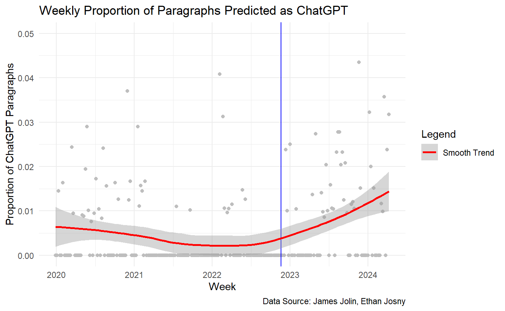

# Abstract
RoBERTector detects AI-generated sentences with high precision and recall, and performs efficiently with early convergence. In this paper, we provide a novel tool based on the RoBERtector (RoBEREctor) for the detection of artificially generated sentences.

# Introduction

Research Question: To what extent did ChatGPT contribute
to official U.S. Senate press releases?
Generative models like ChatGPT suffers from hallucination,
generating false and misleading information. While U.S. Senate press must have transparency and
accountability, meaning AI generated texts can be dangerous.
Thus we aim to ensure trust in public communication, and maintain transparency and accountability in Senate press
releases by classifying AI generated text in U.S. senate press.


The original idea on this project was using Sentence Transformers(SBERT, for reference view https://sbert.net/) embedding to classify, human and AI generated text. However this attempt was unsuccessful because features that were extracted from SBERT failed to capture any significant information as shown in t-SNE plot below. Seeing this, choose to fine tune pretrained LLM RoBERTa. 


## Theoretical Background

### Perceptrons and Deep Models
|  Perceptrons are the fundamental building block of neural networks, which is introduced by Frank Rosenblatt in 1957. It computes $z$ values using weights, variables, bias like equation below and applies threshold function.
$$z = \sum_i w_i x_i + b$$
{width=50%}
|  Then it works with linear threshold limit, that implements a binary classifier using a linear decision boundary. Also, it updates weights based on prediction errors and gradient descent rules.
|  Deep models are artifical intelligence models that uses artifical neural networks, which is composed of perceptrons. It shows a high performance in linear separable problems, and it is a highly-discussed models among artificial intelligence models.

### MLP, Back propagation and fine tuning
|  MLP is a deep model that extend single perceptrons by adding hidden layers with nonlinear activation functions. MLPs with sufficient hidden units can approximate any continuous function.


| Fine-tuning is a supervised adaptation to specific tasks, where a pretrained model is further trained on labeled data to specialize in a narrower domain or objective. 


### Transformers and attention mechanism
|  Attention mechanism is an text interpretation mechanism that focuses on relevant parts of input sequences dynamically. It selectively focuses on important information, computes attention weights that reflect the relative importance. Also, it uses three matrices to compute attention scores and weighted representations.
$$\text{Attention(}Q,K,V\text{)}=\text{softmax(}\frac{QK^T}{\sqrt{d_k}}\text{)} $$
|  Transformers is an sequence modeling system that relys entirely on attention mechanisms, which allows the models to attend to different positions in the input sequence simultaneously.
|  It uses encoder-decoder architecture, which consists of both encoder and decoder components, though variations exist. In addition, transformer's don't have inherent sequential processing, so positional information is added via endcodings in transformer.

### LLM, BERT and RoBERTa
|  Large Language Model(LLM)is a class of neural networks trained on vast amounts of text data to understand and generate human language. It is build on the transformer model with self-attention mechanisms. Also, it uses autoregressive generation, which predicts the next token in a sequence based on previous tokens. LLM training is held through pre-training(unsupervised learning on large text corpora), fine-tuning(supervised adaptation to specific tasks), in-context learning(learning from examplex provided in the input).
| BERT is an LLM, large language model that represents a paradigm shift in natural language processing by introducing bidirectional training for language representations. BERT also uses masked language modeling(MLM), by using a novel pre-trained objective where some tokens are randomly masked and the model predicts them. In addition, BERT utilizes transformer encoder architecture and transfer learning to enhance its performance.
|  RoBERTa (Robustly Optimized BERT Pretraining Approach) is an enhanced version of BERT that builds on the transformer architecture with these several key improvements:
|  Dynamic Masking: Unlike BERT's static masking, RoBERTa uses dynamic masking to generate different masked tokens for the same sentence during training, allowing the model to learn from various input sequences.
|  Removal of Next Sentence Prediction (NSP): RoBERTa eliminates the NSP task, focusing solely on the Masked Language Modeling (MLM) objective.
|  Larger Training Data and Batch Sizes: Uses much larger mini-batches and learning rates with significantly more training data.
|  Byte-level Byte Pair Encoding (BPE): Implements the same tokenization as GPT-2, using a smaller vocabulary that requires fewer computational resources.

## Theoretical Background: Integrated Gradients

To interpret the predictions made by deep neural networks, we apply **Integrated Gradients (IG)** — a method introduced to attribute a model's prediction to its input features. IG helps identify which tokens or sentences contribute most to the final classification outcome.

Formally, for a model \( F \) and an input \( x \), the integrated gradient of the \( i \)-th feature is defined as:

$$
\text{IG}_i(x) = (x_i - x_i') \times \int_{\alpha=0}^1 \frac{\partial F(x' + \alpha \cdot (x - x'))}{\partial x_i} \, d\alpha
$$

where \( x' \) is a baseline input (e.g., zero embedding), and the integral computes the average gradient of the model output with respect to the input along the path from \( x' \) to \( x \).

By aggregating gradients across interpolated inputs, IG provides a more stable and theoretically justified measure of feature importance compared to raw gradients. This is particularly useful in our context of AI-text detection, as it allows us to visualize and explain which words or sentences influenced the model's decision.


## RoBERTector

RoBERTector is finetuned RoBerta that specify on AI detection on sentence level. it's predeictive abilitwes were Accuracy: 0.8648  F1 Score: 0.8644 on validation set. 

## Architecture


|  A paragraph’s “main content” is concentrated in a small subset of its sentences, and by assigning higher attention weights to those key sentences (and down‑weighting the rest), the model can accurately classify the paragraph as AI‑generated vs. human‑written. This main content is valid because of various point of view, psycholingustics, cognitive science, deep-learning.

### Psycholingustics Perspective
|  People tend to focus on main point of view instead of remembering all details. This is because gist information is more efficiently encoded, thereby being meaningful into memory. People prefer the most meaningful portion of the text, so people usually remember the main idea most. Also, according to Van Dijk and Kintsch's discourse comprehension theory, people are reported to remember contents by compressing and generalizing to macro-level semantic structure (gist). 

### Cognitive Science Perspective
|  It is proved in cognitive science fields that people get their attention on main ideas. Our cognitive system processes and emphasizes data selectively rather than catching full context at once. For example, when we write essays, people usually loads the most information, main idea, into the first sentence or paragraph instead of spreading contexts into paragraph or full text.
  
### Deep-Learning Perspective
|  Attention mechanism, which is utilized in this research, is a technology that aimed to weigh more on main factors. This is inspired by selective cognition mechanism of people, and led to optimization in model efficiency by lowering the burden to encode long text at once.
|  In special, Multi-Head Attention uses lots of attention heads, so it collects complex main information in parell. Through this mechanism, attention layer assigns high value in most informative sentences while considering sentence-sentence interactions. So, in summry, the model creates embedding that represents full meaning by focusing main sentences in the text.
 

  Our model begins by **splitting each paragraph** into at most 16 sentences.  We scan for sentence delimiters (`.`, `?`, `!`), trim whitespace, and discard empty fragments.  If a paragraph produces fewer than 16 sentences, we pad the remainder with dummy tokens; if it exceeds 16, we simply truncate after the 16th.  This approach guarantees every input tensor has a fixed shape `(batch_size × 16 × max_length)`, which simplifies batching and avoids dynamic control‐flow overhead.

  Next, each of these up to 16 sentence slots is **encoded independently** by RoBERTector(a RoBERTa model that was previously fine‑tuned on sentence‑level AI vs. human text classification).  By freezing all of RoBERTector’s parameters, we preserve its robust ability to capture subtle stylistic and lexical cues (word choice, phrasing patterns, function‐word frequencies) without risking over‑fitting on our comparatively small paragraph dataset.  From each sentence’s transformer output we extract the `CLS` token embedding (a 768‑dimensional vector), producing a tensor of shape `(batch_size, 16, 768)`.

  These 16 sentence embeddings are then fed into a **multi‑head self‑attention layer** (four heads, embed_dim=768).  Because the Query, Key, and Value all derive from the same set of sentence embeddings, the attention mechanism learns to assign higher weights to the most informative sentences—thesis statements, topic transitions, or discourse markers—while down‑weighting less relevant ones.  The attended outputs are mean‑pooled across the sentence axis, yielding a single 768‑dimensional “paragraph embedding” that fuses both micro‑level sentence cues and macro‑level discourse structure.

  Finally, a **lightweight classification head** (a two‑layer MLP with ReLU and dropout) maps this paragraph embedding to a single logit.  We apply `BCEWithLogitsLoss` during training—combining sigmoid activation and binary cross‑entropy in a numerically stable way—and use a 0.5 threshold on the sigmoid probability to make the AI vs. human decision.  We train only the attention and MLP head (leaving RoBERTector frozen), save model checkpoints after every epoch, and evaluate on an 80/10/10 train/val/test split of our ~20 000‑paragraph dataset (with test performed just once at the end).

  By **reusing** a specialized sentence encoder, **learning** which sentences truly matter via attention, and **regularizing** most of the model by freezing, this architecture achieves high accuracy and generalization while remaining interpretable: attention weights can be visualized to show exactly which sentences drove each classification.

# Training

## Set up python enviroment
```{r setup, include=FALSE,, warning = FALSE, message = FALSE}
knitr::opts_chunk$set(echo = TRUE)
library(reticulate)

use_python(
  "C:/Users/ahnd6/AppData/Local/Programs/Python/Python39/python.exe", #use your own path to python
  required = TRUE
)
py_config()

```
## Install packages
```{r install-python-pkgs, include=FALSE, eval=FALSE, warning = FALSE, message = FALSE}
library(reticulate)

# packages to install
pkgs <- c('transformers', 'datasets', 'torch',
          'scikit-learn', 'evaluate', 'pandas', 'tqdm')

# Detect packages that are not yet installed
to_install <- pkgs[!sapply(pkgs, py_module_available)]

if (length(to_install)) {
  # install as pip option
  py_install(packages = to_install, pip = TRUE)
}
```

## Fine tune RoBERTa

### Load data and split paragraphs into sentences
```{python, eval=FALSE, warning = FALSE, message = FALSE}
import pandas as pd
df=pd.read_csv('ai_press_releases.csv')
df=df.dropna()
human=df['non_chat_gpt_press_release']
ai=df['chat_gpt_generated_release']
hu=[]
a=[]
for i in human:
    l=list(i.split('. '))
    hu.extend(l)
for i in ai:
    l=list(i.split('. '))
    a.extend(l)

ap=a.copy()
a.extend(hu)
texts=a
labels=[0 if i<len(ap) else 1 for i in range(len(texts))]
from sklearn.model_selection import train_test_split

#split train, test and validation data. 
texts_train_val, texts_test, labels_train_val, labels_test = train_test_split(
    texts,
    labels,
    test_size=0.2,       # 20% of the entire dataset
    random_state=42,
    stratify=labels      # Maintain label distribution
)

# 2) Split train_temp again into train (75% of temp → 60% of the total) and val (25% of temp → 20% of the total)
texts_train, texts_val, labels_train, labels_val = train_test_split(
    texts_train_val,
    labels_train_val,
    test_size=0.25,      #25% of train_temp → 0.2 of total
    random_state=42,
    stratify=labels_train_val
)

print(f"Train: {len(texts_train)} samples")
print(f"Valid: {len(texts_val)} samples")
print(f"Test : {len(texts_test)} samples")

```

### Load Roberta and fine tune
```{python, eval=FALSE, warning = FALSE, message = FALSE}
import torch
from torch.utils.data import DataLoader
from transformers import AutoTokenizer, AutoModelForSequenceClassification
from torch.optim import AdamW
from datasets import Dataset
from tqdm.auto import tqdm
from sklearn.metrics import accuracy_score, f1_score

# Load pretrained tokenizer
tokenizer = AutoTokenizer.from_pretrained("roberta-base")

# Function to prepare batch inputs
def collate_fn(batch):
    enc = tokenizer(
        [x["text"] for x in batch],  # Extract texts
        padding="longest",           # Pad to the longest in batch
        truncation=True,             # Truncate if too long
        max_length=256,              # Limit to 256 tokens
        return_tensors="pt"          # Return PyTorch tensors
    )
    enc["labels"] = torch.tensor([x["label"] for x in batch], dtype=torch.long)
    return enc

# Convert to HuggingFace Dataset format
train_ds = Dataset.from_dict({"text": texts_train, "label": labels_train})
val_ds   = Dataset.from_dict({"text": texts_val,   "label": labels_val})
test_ds  = Dataset.from_dict({"text": texts_test,  "label": labels_test})

# Create PyTorch DataLoaders
train_loader = DataLoader(train_ds, batch_size=16, shuffle=True, collate_fn=collate_fn)
val_loader   = DataLoader(val_ds,   batch_size=32, shuffle=False, collate_fn=collate_fn)
test_loader  = DataLoader(test_ds,  batch_size=32, shuffle=False, collate_fn=collate_fn)

# Model and optimizer configuration
device = torch.device("cuda" if torch.cuda.is_available() else "cpu")  # Use GPU if available
model  = AutoModelForSequenceClassification.from_pretrained("roberta-base", num_labels=2).to(device)  # Binary classification
optim  = AdamW(model.parameters(), lr=2e-5)  # Use AdamW optimizer

num_epochs = 8  # Train for 8 epochs

# Training loop
for epoch in range(1, num_epochs+1):
    # 1) Training phase
    model.train()
    train_loop = tqdm(train_loader, desc=f"Epoch {epoch}/{num_epochs} [TRAIN]")  # Show progress
    for batch in train_loop:
        batch = {k: v.to(device) for k, v in batch.items()}  # Move to GPU
        outputs = model(**batch)  # Forward pass
        loss    = outputs.loss
        optim.zero_grad()  # Reset gradients
        loss.backward()  # Backpropagation
        optim.step()  # Update weights
        gpu_mem = torch.cuda.memory_allocated(device) // (1024**2)  # Monitor GPU memory
        train_loop.set_postfix(loss=f"{loss.item():.4f}", gpu_mem=f"{gpu_mem}MiB")

    # 2) Validation phase
    model.eval()
    all_preds, all_labels = [], []
    val_loop = tqdm(val_loader, desc=f"Epoch {epoch}/{num_epochs} [VAL]  ")
    with torch.no_grad():  # Disable gradient tracking
        for batch in val_loop:
            batch = {k: v.to(device) for k, v in batch.items()}
            logits = model(**batch).logits
            preds  = torch.argmax(logits, dim=-1).cpu().tolist()
            labels = batch["labels"].cpu().tolist()
            all_preds += preds
            all_labels += labels
    val_acc = accuracy_score(all_labels, all_preds)  # Compute accuracy
    val_f1  = f1_score(all_labels, all_preds, average="weighted")  # Compute weighted F1
    print(f"→ Validation | Acc: {val_acc:.4f}, F1: {val_f1:.4f}")

    # 3) Test phase (for monitoring)
    all_preds, all_labels = [], []
    test_loop = tqdm(test_loader, desc=f"Epoch {epoch}/{num_epochs} [TEST] ")
    with torch.no_grad():
        for batch in test_loop:
            batch = {k: v.to(device) for k, v in batch.items()}
            logits = model(**batch).logits
            preds  = torch.argmax(logits, dim=-1).cpu().tolist()
            labels = batch["labels"].cpu().tolist()
            all_preds += preds
            all_labels += labels
    test_acc = accuracy_score(all_labels, all_preds)
    test_f1  = f1_score(all_labels, all_preds, average="weighted")
    print(f"→ Test       | Acc: {test_acc:.4f}, F1: {test_f1:.4f}")

    # 4) Save model
    save_dir = f"/kaggle/working/checkpoint-epoch{epoch}"  # Output directory
    model.save_pretrained(save_dir)       # Save model weights
    tokenizer.save_pretrained(save_dir)   # Save tokenizer files
    print(f"→ Model & Tokenizer saved to: {save_dir}\n")

```

## Training Multi Attention Layer

### Load packages
```{python, eval=FALSE,include=FALSE, warning = FALSE, message = FALSE}
import torch
from torch.utils.data import DataLoader
from transformers import AutoTokenizer, AutoModelForSequenceClassification
from transformers import get_linear_schedule_with_warmup
from torch.optim import AdamW
from datasets import Dataset
from tqdm.auto import tqdm
from sklearn.metrics import accuracy_score, f1_score
import pandas as pd
from sklearn.model_selection import train_test_split
import torch.nn as nn
from torch.utils.data import Dataset, DataLoader, random_split
import random
import os
def set_seed(seed=42):
    random.seed(seed)
    torch.manual_seed(seed)
    torch.cuda.manual_seed_all(seed)

set_seed(42)
```

### Load data
```{python, eval=FALSE, warning = FALSE, message = FALSE}
df=pd.read_csv('/kaggle/input/ai-text/ai_press_releases.csv')
df=df.dropna()
human=df['non_chat_gpt_press_release'].to_list()
ai=df['chat_gpt_generated_release'].to_list()
labels=[0 if i<len(ai) else 1 for i in range(len(ai)+len(human))]
ai.extend(human)
texts=ai
# 1)split train_temp(80%) and test(20%)
texts_train_val, texts_test, labels_train_val, labels_test = train_test_split(
    texts,
    labels,
    test_size=0.2,       # 20% of the total
    random_state=42,
    stratify=labels      # Maintain label distribution
)

# 2) Split train_temp again into train (75% of temp → 60% of the total) and val (25% of temp → 20% of the total)
texts_train, texts_val, labels_train, labels_val = train_test_split(
    texts_train_val,
    labels_train_val,
    test_size=0.25,      #25% of train_temp → 0.2 of total
    random_state=42,
    stratify=labels_train_val
)

print(f"Train: {len(texts_train)} samples")
print(f"Valid: {len(texts_val)} samples")
print(f"Test : {len(texts_test)} samples")
```

### Define helper and Multiattention layer class

```{python, eval=FALSE, warning = FALSE, message = FALSE}
# 2. Sentence split
def split_sentences(paragraph: str):
    return [s.strip() for s in paragraph.split('. ') if s.strip()]

# 3. Dataset
class ParagraphDataset(Dataset):
    def __init__(self, texts, labels, tokenizer, max_sents=16, max_len=128):
        self.texts = texts
        self.labels = labels
        self.tokenizer = tokenizer
        self.max_sents = max_sents
        self.max_len = max_len

    def __len__(self):
        return len(self.texts)

    def __getitem__(self, i):
        para = self.texts[i]
        label = torch.tensor(self.labels[i], dtype=torch.float)
        sents = split_sentences(para)[:self.max_sents]
        encs = [self.tokenizer(s, truncation=True, padding='max_length',
                               max_length=self.max_len, return_tensors='pt')
                for s in sents]
        # pad sentences
        pad_n = self.max_sents - len(encs)
        input_ids = torch.stack([e['input_ids'].squeeze(0) for e in encs] +
                                [torch.zeros(self.max_len, dtype=torch.long)]*pad_n)
        attn_mask = torch.stack([e['attention_mask'].squeeze(0) for e in encs] +
                                [torch.zeros(self.max_len, dtype=torch.long)]*pad_n)
        return input_ids, attn_mask, label

# 4. Model: frozen encoder + attention + classifier
import torch
import torch.nn as nn
from transformers import AutoTokenizer, AutoModelForSequenceClassification

class HierAttnClassifier(nn.Module):
    def __init__(self,
                 base_model_name="/kaggle/input/robertector/transformers/sentences/1/checkpoint-epoch3",
                 max_sents=16,
                 hidden=768,
                 heads=4):
        super().__init__()
        # 1) Load your fine‑tuned SequenceClassification model
        self.full_model = AutoModelForSequenceClassification.from_pretrained(
            base_model_name, output_hidden_states=True, return_dict=True
        )
        # 2) Freeze all its parameters
        for p in self.full_model.parameters():
            p.requires_grad = False

        # 3) Multi‑Head Attention on the CLS embeddings
        self.attn = nn.MultiheadAttention(embed_dim=hidden,
                                          num_heads=heads,
                                          batch_first=True)
        # 4) Final MLP head after attention
        self.classifier = nn.Sequential(
            nn.Linear(hidden, hidden // 2),
            nn.ReLU(),
            nn.Dropout(0.1),
            nn.Linear(hidden // 2, 1),
        )

    def forward(self, input_ids, attention_mask):
        b, s, l = input_ids.size()
        # flatten to (b*s, l)
        flat_ids   = input_ids.view(b * s, l)
        flat_mask  = attention_mask.view(b * s, l)
        # 5) Run through RoBERTector; we asked for hidden_states
        outputs = self.full_model(
            input_ids=flat_ids,
            attention_mask=flat_mask,
        )
        # 6) Grab the last hidden layer states: outputs.hidden_states is a tuple
        #    where hidden_states[-1] is (batch, seq_len, hidden)
        last_hid = outputs.hidden_states[-1]        
        # CLS is token 0
        cls_embs = last_hid[:, 0, :].view(b, s, -1)  # (b, s, hidden)

        # 7) Self‑attention over the s sentence embeddings
        attn_out, _ = self.attn(cls_embs, cls_embs, cls_embs)  # (b, s, hidden)

        # 8) Pool and classify
        doc_emb = attn_out.mean(dim=1)                       # (b, hidden)
        logits = self.classifier(doc_emb).squeeze(-1)        # (b,)
        return logits
```

### Load RoBERTector and set up hyperparameters

```{python, eval=FALSE, include=FALSE,warning = FALSE, message = FALSE}
# 5. Prepare data, loaders, model, optimizer
model_path = "/kaggle/input/robertector/transformers/sentences/1/checkpoint-epoch3"
device = torch.device("cuda" if torch.cuda.is_available() else "cpu")

# Load the tokenizer from the directory
# This reads files like tokenizer.json and tokenizer_config.json
tokenizer = AutoTokenizer.from_pretrained(model_path)

# Load the model from the directory
model = AutoModelForSequenceClassification.from_pretrained(model_path).to(device)
dataset = ParagraphDataset(texts, labels, tokenizer)
n = len(dataset)
# Split the dataset into training (60%), validation (20%), and test (20%) sets
train_n = int(0.6*n); val_n = int(0.2*n); test_n = n - train_n - val_n
train_ds, val_ds, test_ds = random_split(dataset, [train_n, val_n, test_n])

# Wrap the datasets with PyTorch DataLoader for mini-batch training and parallel data loading
train_loader = DataLoader(train_ds, batch_size=64, shuffle=True, num_workers=2)
val_loader   = DataLoader(val_ds, batch_size=64, num_workers=2)
test_loader  = DataLoader(test_ds, batch_size=64, num_workers=2)

device = torch.device('cuda' if torch.cuda.is_available() else 'cpu')# Define the device again (potentially redundant)
model = HierAttnClassifier().to(device)# Initialize a custom hierarchical attention-based classifier model
opt = torch.optim.AdamW(filter(lambda p: p.requires_grad, model.parameters()), lr=1e-4)# Use AdamW optimizer with only the trainable parameters
criterion = nn.BCEWithLogitsLoss()# Use binary cross-entropy loss with logits for multi-label classification

```

### Train Multi Attention Layer
```{python, eval=FALSE,include=FALSE, warning = FALSE, message = FALSE}
from tqdm.auto import tqdm

num_epochs = 6
os.makedirs('/kaggle/working/ckpts', exist_ok=True) # Directory to save model checkpoints


for epoch in range(1, num_epochs + 1):
    # ── TRAIN ───────────────────────────────────────────────
    model.train()  # Set model to training mode
    train_loss_sum = 0.0
    train_steps    = 0
    loop = tqdm(train_loader, desc=f"Train E{epoch}")
    for ids, mask, lbl in loop: 
        ids, mask, lbl = ids.to(device), mask.to(device), lbl.to(device)
        # Move input IDs, attention masks, and labels to the correct device
        opt.zero_grad()
        logits = model(ids, mask)
        loss   = criterion(logits, lbl)
        loss.backward()
        opt.step()

        train_loss_sum += loss.item()
        train_steps    += 1
        # Display current batch loss on the tqdm progress bar
        loop.set_postfix(loss=f"{loss.item():.4f}")  # Update progress bar with current batch loss

    avg_train_loss = train_loss_sum / train_steps
    print(f"Epoch {epoch} | Train Loss: {avg_train_loss:.4f}")

    # ── VALIDATION ─────────────────────────────────────────
    model.eval()  # Set model to evaluation mode
    val_loss_sum = 0.0
    preds, trues = [], []
    with torch.no_grad():  # Disable gradient calculation for validation
        for ids, mask, lbl in val_loader:
            ids, mask, lbl = ids.to(device), mask.to(device), lbl.to(device)
            logits = model(ids, mask)
            loss   = criterion(logits, lbl)
            val_loss_sum += loss.item()
             # Apply sigmoid and threshold at 0.5 to get binary predictions
            preds += (torch.sigmoid(logits) > 0.5).cpu().int().tolist()
            trues += lbl.cpu().int().tolist()
    avg_val_loss = val_loss_sum / len(val_loader)  # Average validation loss
    acc = accuracy_score(trues, preds)             # Accuracy metric
    f1  = f1_score(trues, preds)                   # F1 score (macro or binary depending on usage)
    print(f"Epoch {epoch} | Val Loss: {avg_val_loss:.4f} | Acc: {acc:.4f} | F1: {f1:.4f}")

    # ── CHECKPOINT SAVE ────────────────────────────────────
    checkpoint_path = f"/kaggle/working/ckpts/epoch{epoch}.pt"
    torch.save(model.state_dict(), checkpoint_path)
    print(f"Saved checkpoint: {checkpoint_path}")

# ── FINAL TEST ────────────────────────────────────────────
model.load_state_dict(torch.load('/kaggle/working/ckpts/epoch6.pt'))  
model.eval()
preds, trues = [], []
with torch.no_grad():   # No gradient calculation needed during evaluation
    for ids, mask, lbl in test_loader:
        ids, mask, lbl = ids.to(device), mask.to(device), lbl.to(device)
        logits = model(ids, mask)
        preds += (torch.sigmoid(logits) > 0.5).cpu().int().tolist()
        trues += lbl.cpu().int().tolist()
        
# Compute final test metrics
acc = accuracy_score(trues, preds)   
f1  = f1_score(trues, preds)
print(f"Test Acc {acc:.4f} | F1 {f1:.4f}")
```

# Results

## FineTuning

{width=50%}
{width=50%}
|  The above graphs show the relation with epoch, accuracy and f1 score of the model. From the diagram, model from epoch 3 recorded the highest accuracy and f1 score in both validation and test sets. As a result, we chose the model from epoch 3 for the following steps.

## Training Multi Attention layer

{width=50%}
|  Above plot shows the loss in train and validation sets as train proceeds. Both losses decreased until epoch 4, but validation loss increased after epoch 4 while train loss decreased.

{width=50%}
|  The above graph shows the accuracy and f1 score of the model by epoch. At the diagram, the open form of two index were similar, and model from epoch 4 recorded the highest accuracy and f1 score in both validation and test sets.
| As a result, we selected the model from epoch 4. It is because, in the aspect of loss, the validation loss recorded the lowest at that point so that it can avoid overfitting. Also, in the aspect of accuracy and f1 score, the model from epoch 4 recorded the highest index above all.

## Confusion Matrix and ROC Curve
{width=50%}
| The above figure representes the normalized confusion matrix of the model. As being shown in the diagram above, the model achieved high classification performance, predicting both data labeled with 0 and 1 in 99% accuracy. Also, the misclassification rates are relatively low, 0.6% in false negative prediction and 0.61% in false positive prediction.

{width=50%}
|  This diagram shows the ROC curve of the model. In the diagram above, the model's ROC curve was mostly tangent with both axis, compared to the dotted line(random classification model). Also, the AUC(area below the ROC curve) recorded 0.994, which is a lot similar to 1.
|  From the above confusion matrix and ROC curve, we could conclude that model we trained showed high performance in the dataset, so this model is highly reliable in distinguishing between the two classes.


## Analysis

### Weekly Proportion and its Smooth Line
```{r, include=FALSE, eval=FALSE, warning = FALSE, message = FALSE}
# Library Loading
library(tidyverse)
library(lubridate)

# Load and Preprocess Data
df <- read_csv("data/prob.csv")

# Invert Probabilities (AI = 1, Human = 0)
df <- df %>%
  mutate(probability = 1 - probability,
         prediction = 1 - prediction,
         Week = floor_date(as.Date(Date), unit = "week"))

# Weekly Mean Calculation
df_mean <- df %>%
  group_by(Week) %>%
  summarise(mean_chatgpt = mean(prediction), .groups = "drop")

# GPT Release Date
gpt_date <- floor_date(as.Date("2022-11-21"), unit = "week")

# Subsets for Pre and Post-GPT
df_pre_gpt <- df %>% filter(Week <= gpt_date)
df_post_gpt <- df %>% filter(Week > gpt_date)

# Plot 1: Smoothed Trend Line with Points
ggplot(data = df_mean, aes(x = Week, y = mean_chatgpt)) +
  geom_point(color = "gray") +
  geom_vline(xintercept = gpt_date, color = "blue") +
  geom_smooth(aes(color = "Smooth Trend"), se = TRUE) +
  scale_color_manual(values = c("Smooth Trend" = "red")) +
  coord_cartesian(ylim = c(0, 0.05)) +
  theme_minimal() +
  labs(x = "Week",
       y = "Proportion of ChatGPT Paragraphs",
       title = "Weekly Proportion of Paragraphs Predicted as ChatGPT",
       caption = "Data Source: James Jolin, Ethan Josny",
       color = "Legend")

```
{width=50%}
  This graph shows the **distribution of the weekly proportion of paragraphs predicted as ChatGPT** by RoBERTector. In this graph, blue horizontal line indicates the time that ChatGPT was firsh released, and red line is the smooth trend line of distribution. As you can see from the graph, after ChatGPT, the trend of weekly propotion seems to increase.
  

### Average of Pre-GPT, Post_GPT
```{r,include=FALSE, eval=FALSE, warning = FALSE, message = FALSE}
# Calculate Pre/Post GPT Means
pre_mean <- mean(df_pre_gpt$prediction)
post_mean <- mean(df_post_gpt$prediction)

# Plot 2: Pre/Post GPT Mean Lines
ggplot(data = df_mean, aes(x = Week, y = mean_chatgpt)) +
  geom_segment(aes(x = min(Week), xend = gpt_date,
                   y = pre_mean, yend = pre_mean, color = "Pre-GPT Mean"),
               size = 1.2) +
  geom_segment(aes(x = gpt_date, xend = max(Week),
                   y = post_mean, yend = post_mean, color = "Post-GPT Mean"),
               size = 1.2) +
  scale_color_manual(values = c("Pre-GPT Mean" = "skyblue", "Post-GPT Mean" = "pink")) +
  geom_point(color = "gray") +
  geom_vline(xintercept = gpt_date, color = "blue") +
  coord_cartesian(ylim = c(0, 0.05)) +
  theme_minimal() +
  labs(x = "Week",
       y = "Proportion of ChatGPT Sentences",
       title = "Mean of Weekly Proportion of Sentences Predicted as ChatGPT",
       caption = "Data Source: James Jolin, Ethan Josny",
       color = "Legend")
```
{width=50%}
  This graph shows the **mean of ChatGPT-classified paragraph proportion** in post-GPT(pink line), pre-GPT period(skyblue line). The mean of paragraph proportion in pre-GPT period recorded 0.004231799, and 0.008446278 in post-GPT period. It shows that the proportion increased after official release of ChatGPT.


### Linear Regression of Post-GPT
```{r,include=FALSE, eval=FALSE, warning = FALSE, message = FALSE}
# Dataframe Storing Post GPT's ChatGPT Proportion
df_post_mean <- df_mean %>% filter(Week > gpt_date)

# Linear Regression Model
model <- lm(mean_chatgpt ~ Week, data = df_post_mean)
co <- coef(model)

# Stores Linear Regression's Estimation Result
df_post_mean <- cbind(df_post_mean, predict(model, interval = 'confidence'))

# Get's Linear Model's Equation
equation <- paste("prop =", round(co[2], 6), "× Week +", round(co[1], 2))
legend_label <- paste("Post-GPT Trend\n(", equation, ")", sep = "")
df_post_mean$legend <- legend_label

# Plot 3: Linear Regression After GPT Release
ggplot(data = df_mean, aes(x = Week, y = mean_chatgpt)) +
  geom_point(color = "gray") +
  geom_vline(xintercept = gpt_date, color = "blue") +
  geom_line(data = df_post_mean, aes(x = Week, y = fit, color = legend), size = 1.2) +
  scale_color_manual(values = setNames("red", legend_label)) +
  coord_cartesian(ylim = c(0, 0.05)) +
  theme_minimal() +
  labs(x = "Week",
       y = "Proportion of ChatGPT Paragraphs",
       title = "Weekly Proportion of Paragraphs Predicted as ChatGPT",
       caption = "Data Source: James Jolin, Ethan Josny",
       color = "Legend")
```
{width=50%}
  This graph shows the distribution of weekly proportioin of paragraphs which is predicted as ChatGPT, with its **linear regression model** fitted with post-GPT period data. Equation of linear regression model was approximately $\text{Proportion} = 1.808295\times10^{-5} × \text{Week} - 3.449049\times10^{-1}$. The coefficient of "Week" variable was positive, so we can conclude that usage of ChatGPT in U. S. Senate press releases has been increasing since the release of ChatGPT.


## Interpretation
### Wordcloud

```{r,include=FALSE, eval=FALSE, include=FALSE, eval=FALSE, warning = FALSE, message = FALSE}
library(tidyverse)
library(wordcloud)
library(dplyr)
library(RColorBrewer)
library(stopwords)

par(cex=1.25)

interpert <- read_csv("data/interpretation.csv") #Use zip file included

df_clean <- interpert %>%
  mutate(
    token = as.character(token),
    token_weight = as.numeric(token_weight)
  ) %>%
  mutate(
    token = gsub("â", "", token),
    token = gsub("Ġ", "", token),
    token = gsub("[[:punct:]]", "", token),
    token = tolower(token)
  ) %>%
  filter(
    !grepl("<s>|</s>", token),
    !tolower(token) %in% stopwords::stopwords("en"),
    nchar(token) > 2,
    !token %in% c("â", "s", "l", "u", "f", "at", "il", "la", "lo", "jo")
  ) %>%
  group_by(token) %>%
  summarise(weight = sum(token_weight, na.rm = TRUE)) %>%
  ungroup()

wordcloud(
  words = df_clean$token,
  freq = df_clean$weight,
  min.freq = 1,
  max.words = 100,
  random.order = FALSE,
  scale = c(4, 0.5),
  colors = brewer.pal(8, "Dark2")
)
```
{width=50%}
According to word cloud, the model gains the most contextual meaning from 'senator', the text being U.S. senate press is logical.

### Heatmaps
```{r,include=FALSE, eval=FALSE, include=FALSE, eval=FALSE, warning = FALSE, message = FALSE}
library(tidyverse)
library(jsonlite)
library(ggplot2)

# 데이터 불러오기
df <- read_csv("data/interpretation.csv")

# sentence_weight: JSON vector sum
df <- df %>%
  mutate(sentence_weight = map_dbl(sentence_weight, ~ {
    tryCatch({
      val <- sum(fromJSON(.))
      if (is.null(val)) NA_real_ else val
    }, error = function(e) NA_real_)
  }))

# mean paragraph
heatmap_df <- df %>%
  group_by(paragraph_id, sentence_rank) %>%
  summarise(weight = mean(sentence_weight, na.rm = TRUE), .groups = "drop") %>%
  filter(paragraph_id >= 0 & paragraph_id <= 15) %>%
  mutate(
    paragraph_id = factor(paragraph_id, levels = 0:15),
    sentence_rank = factor(sentence_rank, levels = sort(unique(sentence_rank)))
  )

# in paragraph min-max norm
heatmap_df <- heatmap_df %>%
  group_by(paragraph_id) %>%
  mutate(
    weight_min = min(weight, na.rm = TRUE),
    weight_max = max(weight, na.rm = TRUE),
    weight_norm_paragraph = if_else(
      weight_max - weight_min == 0,  # 만약 max = min인 경우 
      0,
      (weight - weight_min) / (weight_max - weight_min)
    )
  ) %>%
  ungroup()

# Heatmap
ggplot(heatmap_df, aes(x = sentence_rank, y = paragraph_id, fill = weight_norm_paragraph)) +
  geom_tile(color = "white", linewidth = 0.5) +
  scale_fill_gradientn(
    colours = c("#0d0887", "#6a00a8", "#b12a90", "#e16462", "#fca636", "#f0f921"),
    limits = c(0, 1),
    na.value = "grey90"
  ) +
  labs(
    title = "Heatmap of Sentence Weight Normalized by Paragraph (Min-Max)",
    x = "Sentence Rank",
    y = "Paragraph ID",
    fill = "Normalized\nWeight"
  ) +
  theme_minimal(base_size = 13) +
  theme(
    axis.text.x = element_text(angle = 45, hjust = 1),
    panel.grid = element_blank()
  )
```

Heat map reveals important sentences in paragraphs.

# Discussion
RoBERTector: strong generalization at sentence level

Hierarchical model: near-perfect paragraph detection

Contextual patterns differ between AI and human writing

Limitations:
• Assumes no AI use before Nov 2022
• Only 10 senators included

Future Work:
• Broader sources and languages
• Mixed-generation detection
• Real-time content screening

# Refernces

Vaswani, A., et al. (2017). Attention Is All You Need. NeurIPS.

Liu, Y., et al. (2019). RoBERTa: A Robustly Optimized BERT Pretraining Approach. arXiv:1907.11692.

Goodfellow, I., Bengio, Y., & Courville, A. (2016). Deep Learning. MIT Press.

Devlin, J., et al. (2019). BERT: Pre‐training of Deep Bidirectional Transformers for Language Understanding.

Rogers, A., et al. (2020). A Primer on Neural Network Models for Natural Language Processing.

Bahdanau, D., et al. (2014). Neural Machine Translation by Jointly Learning to Align and Translate.

Luong, M., et al. (2015). Effective Approaches to Attention‐based Neural Machine Translation.

Rosenblatt, F. (1958). The Perceptron: A Probabilistic Model for Information Storage and Organization in the Brain.

Minsky, M. & Papert, S. (1969). Perceptrons: An Introduction to Computational Geometry.

Rumelhart, D., et al. (1986). Learning Representations by Back‐Propagating Errors.

Brown, T., et al. (2020). Language Models are Few‐Shot Learners.

Radford, A., et al. (2019). Language Models are Unsupervised Multitask Learners.

Wang, W. & Li, Q. (2024). The Basic Theory for Transformer‐based Large Language Models.

Werbos, P. (1974). Beyond Regression: New Tools for Prediction and Analysis in the Behavioral Sciences.

LeCun, Y., et al. (1989). Backpropagation Applied to Handwritten Zip Code Recognition.

Leibniz, G. W. (1684). Nova Methodus pro Maximis et Minimis.

Spivak, M. (1994). Calculus.

Yosinski, J., et al. (2014). How Transferable are Features in Deep Neural Networks?

Howard, J. & Ruder, S. (2018). Universal Language Model Fine‐tuning for Text Classification.

Hu, E., et al. (2021). LoRA: Low‐Rank Adaptation of Large Language Models.

Anthony, M. & Bartlett, P. L. (2009). Neural Network Learning: Theoretical Foundations.

Haykin, S. (2008). Neural Networks and Learning Machines.

Ultralytics. (n.d.). From Code to Conversation: How Does an LLM Work? https://www.ultralytics.com/ko/blog/from-code-to-conversation-how-does-an-llm-work (Accessed: 2025‑07‑06)

Great Learning. (n.d.). What is Fine‑Tuning? https://www.mygreatlearning.com/blog/what-is-fine-tuning/ (Accessed: 2025‑07‑06)


